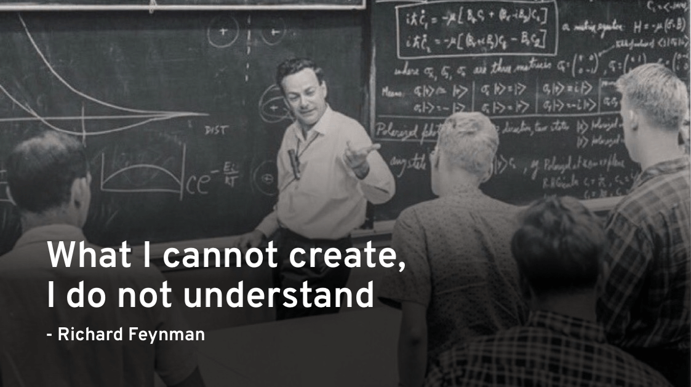

# Nettoy

A toy [Netty Project](https://github.com/netty/netty) for study case

## Table of Content

- [Build Your Own Netty - Foreword](src/main/resources/Build%20Your%20Own%20Netty%20-%20Foreword.md)

- [Build Your Own Netty - Start from BIO](src/main/resources/Build%20Your%20Own%20Netty%20-%20Start%20from%20BIO.md)

- Build Your Own Netty - Move to NIO

- Build Your Own Netty - Reactor Pattern

- Build Your Own Netty - Event-Driven

- Netty - An Overview

- Netty Core Components - EventLoop

- Netty Core Components - Channel

- Netty Core Components - Handler

- Netty Core Components - Pipeline

- Netty Performance (Series)
