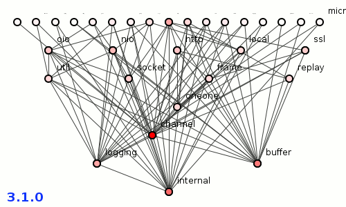

# Build Your Own Netty - Foreword

> This article is originally posted on [@kezhenxu94](https://github.com/kezhenxu94)'s GitHub repository;

## What is Netty

If you are a Java developer, you must have heard about Netty more or less, and it's likely that you
have used it, directly or indirectly. If not, there is a brief introduction from the [Netty Project](https://github.com/netty/netty).

> [Netty project](https://github.com/netty/netty) - an event-driven asynchronous network application framework. http://netty.io/

> Netty is an asynchronous event-driven network application framework for rapid development of
maintainable high performance protocol servers & clients.

## Why I Write This Series of Articles

I've been interested in Netty for a long time, and I have read many blog posts that address Netty's
performance, architecture, and [package structures](https://dzone.com/articles/probably-the-best-package-structure-in-the-world),
which makes me more curious about how Netty did that, and want to dive into the source code of Netty. 
 

> Image above is taken from the post [Netty: Probably the Best Package Structure in the World](https://dzone.com/articles/probably-the-best-package-structure-in-the-world).

Also, there are already [many excellent articles focusing on Netty source code analysis](https://netty.io/wiki/related-articles.html),
but this series of articles will provide another point of view to inspect how Netty is structured, how Netty works, and why it is so performant.

## How this Series of Articles Are Organized

**This series of articles respect a bottom-top approach to analyze the source code of Netty.**

In this series of articles, we will firstly start with a simple Echo server that is written in Java Old I/O library(OIO for short),
and take a look at what's the disadvantages of OIO.

After that, we'll try to solve the problems using Java New(or Non-blocking) I/O library(NIO for short) to rewrite the Echo server,
and make ourselves acquainted with Java NIO APIs, which is fundamental in the source code of Netty. 

To start the journey to Netty's source code, we will also need some basic knowledge about [Reactor Pattern](https://en.wikipedia.org/wiki/Reactor_pattern) and [Event Driven](https://en.wikipedia.org/wiki/Event-driven_programming),
so the next part of this series of articles will introduce both of them and apply them to our Echo server.

Now that we have completed an Echo server by applying the core concepts that Netty uses, we can start the journey to Netty's source code.
We'll take a detailed look at the core components of Netty, say `EventLoop`, `Channel`, `Handler`, `Pipeline` etc. and how they work together.

After that we will dive deeper into the source code of Netty to find out why it is blazingly fast and how it works, (hopefully) including every aspect of optimization in Netty.

So, let's get started and hope you enjoy it.
