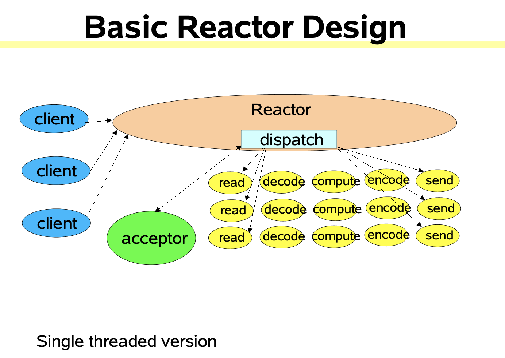
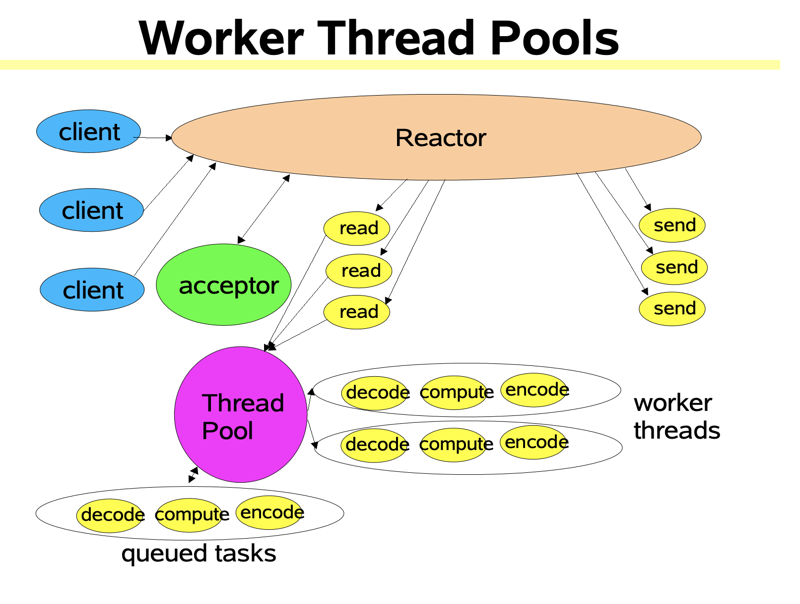

# Build Your Own Netty - Reactor Pattern

> This article is originally posted on [@kezhenxu94](https://github.com/kezhenxu94)'s GitHub repository;

In the [previous post](3.%20Build%20Your%20Own%20Netty%20-%20Reactor%20Pattern.md), we already have an `EchoServer` that is implemented
with Java NIO; Let's check what we have and what we don't for now:

0. All the IO operations (`accept`, `read`, `write`) are done when ready; there's no need to wait synchronously;
0. No need to create thread for every single connection, and requests can be processed **relatively** in time;
0. `EchoServer` can do other stuffs when there's no connection, no waste of resources;
0. All operations are done in the same thread, including `accept`, `read`, `write`, `process`;

Things look good, but the problem is that **"All operations are done in the same thread, including `accept`, `read`, `write`, `process`;"**,
we can respond to the events of `read`, `write`, `accept` operations asynchronously, but not the `process` operation,
and it may take a long time to process the data, which in turn blocks the IO operations, let's solve this by using Reactor Pattern;

## Reactor Pattern in IO

> For more details about Reactor Pattern, please refer to the [WIKI](https://en.wikipedia.org/wiki/Reactor_pattern), or
> the book of GoF.

In some degree, our previous `EchoServer` is one implementation of Reactor Patter:

```java
public class EchoServer {
  public void start() throws Exception {
    while (!Thread.interrupted()) {
      // ...
      for (final Iterator<SelectionKey> iterator = selector.selectedKeys().iterator(); iterator.hasNext(); iterator.remove()) {
        if (key.isReadable()) {
          readData(key);
        }
        if (key.isWritable()) {
          writeData(key);
        }
      }
    }
  }
}
```

- We have an infinite `while` loop in the main thread, behaving like a Reactor, receiving new events;
- When new events happen, the main thread begins to **react**, and **dispatches** the event to `readData` and `writeData`;

This is a basic version of Reactor Patter, and it only has a single thread, all operations happen in it;

Let's make it more `Reactor`-like by simply rewriting in code style, and evolve it into our version 2;

### Version 0 - SingleThreaded

```java
public final class Reactor implements Runnable {
  final Selector selector;
  final Executor eventLoop;
  final ServerSocketChannel serverSocket;

  // ...

  public void bind(final int port) throws IOException {
    serverSocket.bind(new InetSocketAddress(port));
    eventLoop.execute(this);
  }

  @Override
  public void run() {
    // ....
    while (true) {
      final Set<SelectionKey> selectionKeys = selector.selectedKeys();
      selectionKeys.forEach(this::dispatch);
      selectionKeys.clear();
    }
  }

  private void dispatch(final SelectionKey selectionKey) {
    final ChannelHandler handler = (ChannelHandler) selectionKey.attachment();
    if (selectionKey.isReadable() || selectionKey.isAcceptable()) {
      handler.read();
    } else if (selectionKey.isWritable()) {
      handler.write();
    }
  }
}

public final class EchoHandler implements ChannelHandler {
  @Override
  public void read() throws Exception {
    final ByteBuffer buffer = ByteBuffer.allocate(1024);
    socketChannel.read(buffer);
    final String msg = msgCodec.decode(buffer);
    LOGGER.info("<=== " + msg);
    msgQ.addLast(msg);
    // ...
  }

  @Override
  public void write() throws Exception {
    final String msg = msgQ.removeFirst();
    socketChannel.write(msgCodec.encode(msg));
    LOGGER.info("===> " + msg);
    // ...
  }
}
```

There is an `eventLoop` in the Reactor, looping over the ready events, and `dispatch` them to corresponding handlers;
As you can see, all the operations happen in the same thread, including the processing operations, although
the processing operations in our example is rather simple and not time-consuming, it's usually not the case in reality,
and it will blocks the IO operations, which we have made much efforts to make them non-blocking;

> The case where all the operations including IO and processing happen in one thread is called single-threaded Reactor Pattern;



> Credit: picture is taken from [Scalable IO in Java.pdf](../reference/Scalable%20IO%20in%20Java.pdf), Doug Lea

### Version 1 - MultiThreaded

Our next version of Reactor `EchoServer` separates the processing operations (business operations usually) from the IO operations totally,
more technically speaking, it isolates all the IO operations into one single thread, and processing operations can happen in any other thread;

```java
public final class EchoHandler implements ChannelHandler {
  final Executor executor;
  final LinkedBlockingQueue<String> msgQ;

  @Override
  public void read() throws Exception {
    final ByteBuffer buffer = ByteBuffer.allocate(1024);
    socketChannel.read(buffer);
    final String msg = msgCodec.decode(buffer);
    LOGGER.info("[" + Thread.currentThread() + "] <=== " + msg);

    executor.execute(new Processor(msg));
  }

  @Override
  public void write() throws Exception {
    final String msg = msgQ.take();
    final ByteBuffer buffer = msgCodec.encode(msg);
    socketChannel.write(buffer);
    LOGGER.info("[" + Thread.currentThread() + "] ===> " + msg);
  }

  class Processor implements Runnable {
    private final String message;

    @Override
    public void run() {
      try {
        LOGGER.info("[" + Thread.currentThread() + "] is handling message [" + message + "]");
        Thread.sleep(3000L); // Do some time-consuming computations
        msgQ.put(message);
        socketChannel.register(selector, SelectionKey.OP_WRITE).attach(EchoHandler.this);
        selector.wakeup(); // Wake up the selector because it may be waiting for READ events, but we're not interested in READ now
      } catch (final Exception e) {
        e.printStackTrace();
      }
    }
  }
}
```

The `Reactor` is almost the same as the one in [Version 0](#version-0---singlethreaded), what is different is the `EchoHandler`:

- The `read` method reads the data(IO operation) in the main thread;
- Then the handler starts another thread to process the data, and we do some time-consuming computations (`sleep` 3 seconds)
in the thread, after computations, we put the processed result into the cached message queue, which stores the pending write operations;
- Back to the reactor thread, the handler writes/flushes the pending write operations to the channel;



> Credit: picture is taken from [Scalable IO in Java.pdf](../reference/Scalable%20IO%20in%20Java.pdf), Doug Lea

There're several variations of Reactor Pattern, but for now, it may be enough for our Netty journey, and we'll introduce
other variations when needed, such as Multi Reactor design;

> For the complete codes, please refer to [my GitHub repository](http://github.com/kezhenxu94/nettoy)

## Summarize

In this article, we learnt two variations of Reactor Pattern, and rewrote our Echo Server in Reactor Pattern, both single-threaded
and multi-threaded, but for demonstration purpose, we simply put as many as possible classes in the same file, and did not
do much encapsulation work for simplicity, in the following articles, we'll try to rewrite the codes we have, making it
more close to the Netty project, so that we're able to compare and learn from practice;